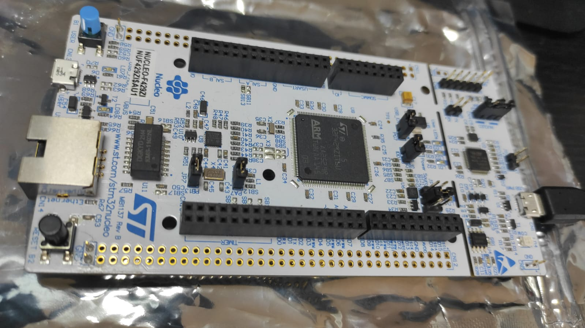

# Embedded-Systems-STM32-HAL-APIs-Driver-Development
Bare-metal programming for the SMT32 Microcontrollers using the HAL library

## Summary
Course work associated with the Udemy.com course "Embedded Systems STM32 HAL APIs Driver Development" , authored by Israel Gbati.

https://www.udemy.com/course/embedded-systems-stm32-hal-apis-driver-development/

* The most of the source code examples are coded for the the specifics of  Nucleo F429ZI. 
* Few other examples apply to the STM32F429I_DISCOVERY1 board. 

In most of the cases, I have specified the target board in the heading of source code files. 

### STM32 Nucleo F429ZI

